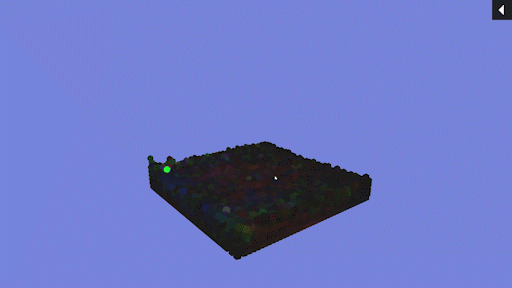

# Fluid Solver
A GPU based fluid solver written in HLSL for Unity 3D during a course in video game physics.

The solver is using the [smoothed-particle hydrodynamics](https://en.wikipedia.org/wiki/Smoothed-particle_hydrodynamics) (SPH) method for simulation. The specific implementation is based on the 2003 paper "Particle-Based Fluid Simulation for Interactive Application" (Müller, M., Charypar, D. & Gross, M.), but is implemented as a compute shader. The forces acting upon each particle is being calculated in parallel och the GPU. This current implementation models the viscosity and pressure forces as presented in the paper. Surface tension forces are however **not** currently being modelled.

## Images
The user can left click to drag around the fluid particles. Holding right click will instead repel the particles from the cursor.

Some of the fluid and simulation parameters can be modified using the user interface.

## In the future
The project no longer actively being developed, there are however some features i'd like to implement in the future.

- __HashGrids__ for better performance when approximating neighboring particle densities.
- __Rendering__, a more interesting look to the fluid 